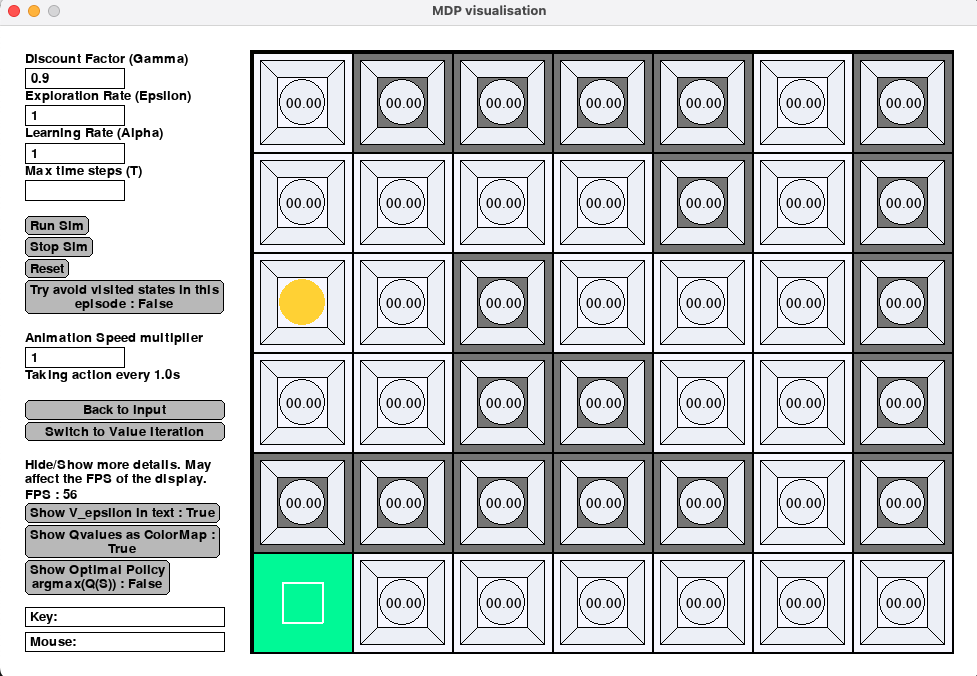

# Markov-Decision-Problem-Simulation

This is a simulation of the standard textbook MDP environment (Robot in a maze) made using SimpleGUI and python.

## Installation

To install all the requirements run

```bash
pip install -r requirements.txt
```

## Environment - Robot in a 2D maze

**States** - Squares on the grid with coordinates (x,y)

**Actions** - Up, Down, Left or Right (If there are walls in a certain direction, those actions don't exist)

**Rewards** -

* +1 on reaching green square
* -1 on reaching red square
* 0 on all others

You can change the grid and draw reward states (+1, -1, wall) and mark which states are "done states" by drawing on the canvas.

After choosing input, you can run either Value Iteration or Q-Learning.

## Run Simulation

```bash
python main.py
```

## Documentation

### Main Page

In main page, you can edit the board to create your own maze, and then choose one algorithm to start the simulation.


There are several buttons on the left, and their functionalities are:

#### Change the grid width/height

* the [+][-] button under Grid Width/Height: adjust the width and height of the grid. You can also enter the number directly in the text box.

#### Create your own board

* Draw +1 Reward: mark a cell as a +1 Reward cell by clicking on the cell. +1 Reward cell will be marked as a green cell.
* Draw -1 Reward: mark a cell as a -1 Reward cell by clicking on the cell. -1 Reward cell will be marked as a red cell.
* Draw wall: mark a cell as a wall by clicking on the cell. The robot will not be able to enter a wall cell. A wall cell will be marked as a grey cell.
* Mark Terminal States: mark a cell as a terminal state by clicking on the cell. The robot will stop moving and the episode is ended when the robot enters a terminal state. The terminal state will be marked by a small square.
* Erase: reset the cell to a blank one.
* Set Start Position: click a cell to change the start position which is marked by a yellow dot.

#### Board selection

We have made a pre-defined

* Next: select the next board.
* Prev: select the previous board.
* Save All Boards: save all boards that you have created.
* Delete Board: delete this board
* New Board: create a new blank board.

#### Simulation control

* Start Value Iteration: start simulation using value iteration algorithm
* Start Q learning: start simulation using Q learning algorithm

### Value Iteration Page


* Discount Factor (Gamma): the discount factor used in value iteration. It should be a value between [0,1].
* Iteration: determine the number of iteration that the algorithm should run.
* Speed: change the simulation speed.
* Show policy: show the learned policy on the board. An arrow is drawed for each cell to indicate which direction the agent should go when it is on the cell.
* Show Agent Path: show the agent's path marked by yellow.
* Show Values: show the estimated value for each state on the cell.

### Q Learning Page



* Discount Factor (Gamma): the discount factor used in Q learning. It should be a value between [0,1].
* Exploration Rate (Epsilon): the exploaration rate used in Q learning. It should be a value between [0,1].
* Learning Rate (Alpha): the learning rate used in Q learning.
* Max time steps: set the maximum time step that Q learning should run.
* Animation Speed multiplier: control the speed of the animation. Change it to a larger value if you find the animation too slow.
