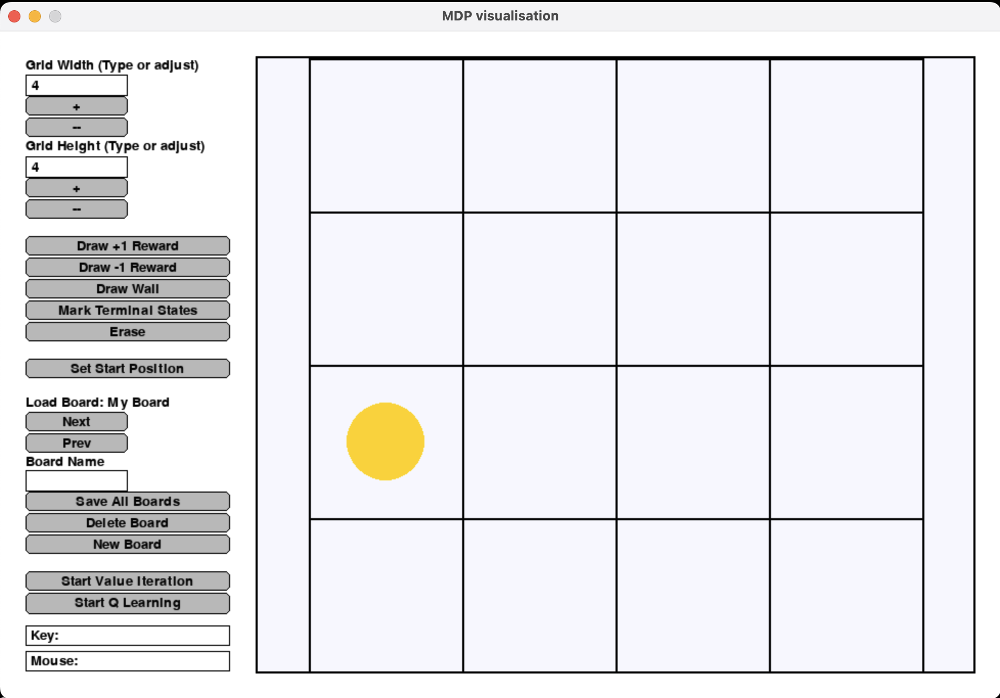
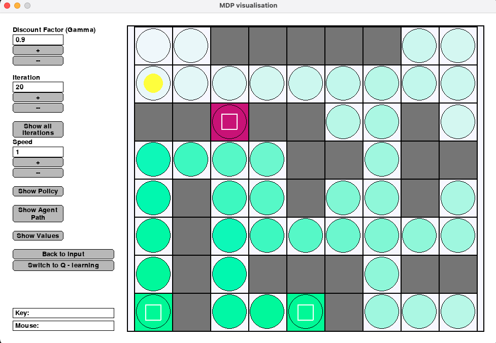
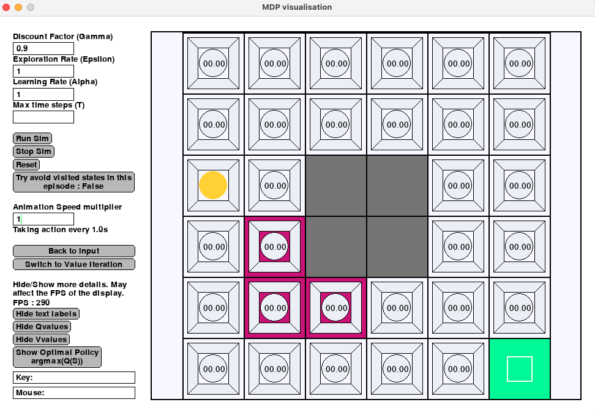
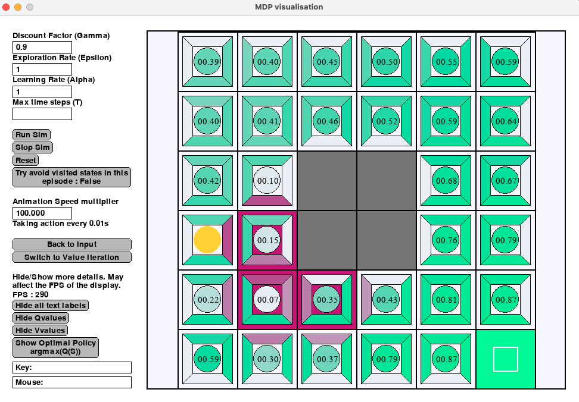
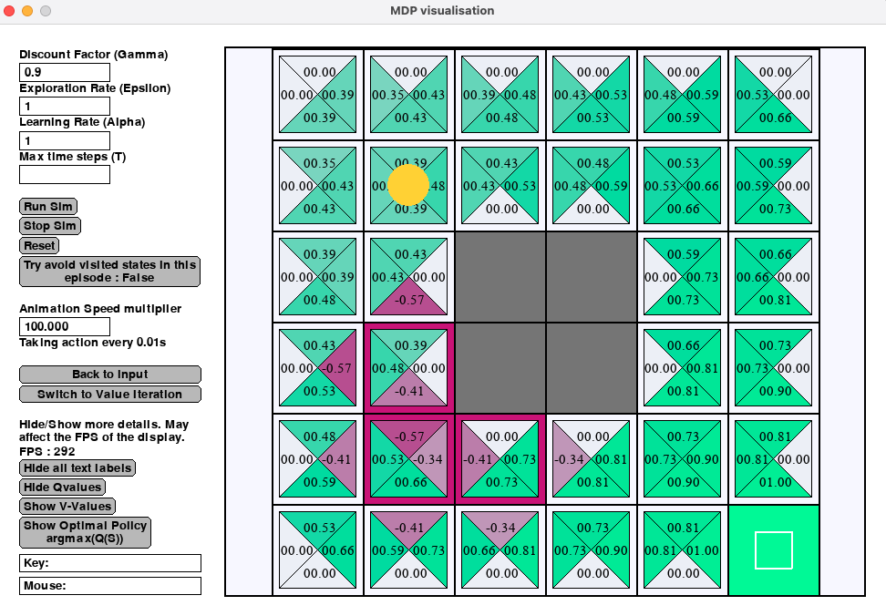

# Markov-Decision-Problem-Simulation

This is a simulation of the standard textbook MDP environment (Robot in a maze) made using SimpleGUI and python.

**Note : We are looking to improve this tool. If you have some time, please send us some feedback here https://forms.gle/UGBbgecAjjWcR26P7**

## Installation

To install all the requirements run

```bash
pip install SimpleGUICS2Pygame
```

_Note : This library requires any text based input in a text box to be followed by a return to register as an input._

## Environment - Robot in a 2D Grid

**States** - Squares on the grid with coordinates (x,y)

**Actions** - Up, Down, Left or Right (If there are walls in a certain direction, those actions don't exist)

**Rewards** -

* +1 on reaching green square
* -1 on reaching red square
* 0 on all others

You can change the grid and draw reward states (+1, -1, wall) and mark which states are "done states" by drawing on the canvas.

After choosing input, you can run either Value Iteration or Q-Learning. (More RL algorithms will be added in the future.)

## Run Simulation

```bash
python main.py
```

## Examine and Evaluate

### Value Iteration
- How many loop iterations does it take for the V-Value of the initial state to be updated at least once?
- You will observe that all reward states are considered terminal in Value Iteration. What would happen if the reward states were not terminal in Value iteration?
- What do you observe about the propogation of signals from **negative** rewards in Value Iteration?


### Q-Learning
- How many episodes does the vanilla QLearning need for the Qvalues of the initial state to be updated at least once?
- What do you observe about the propogation on signals from negative rewards in Q-Learning?
  - How is this propogation affected by Epsilon(the exploration rate) ?
- For larger boards, what affect does gamma have to QValues and Vvalues, when the distance of the start state to the reward state is increased or decreased?
- For a large board with a single terminal state, why does Qlearning finds path to terminal state faster when intermidiate rewards/ penalty is given as compared to when no intermidiate rewards are given?
  - What's the risk of giving positive vs negative intermidiate rewards? Which one gets the desired outcome quicker - positive intermidiate or negative intermidiate?

## Documentation

### Main Page

In main page, you can edit the board to create your own maze, and then choose one algorithm to start the simulation.



There are several buttons on the left, and their functionalities are:

#### Change the grid width/height

* the [+][-] button under Grid Width/Height: adjust the width and height of the grid. You can also enter the number directly in the text box.

#### Create your own board

* Draw +1 Reward: mark a cell as a +1 Reward cell by clicking on the cell. +1 Reward cell will be marked as a green cell.
* Draw -1 Reward: mark a cell as a -1 Reward cell by clicking on the cell. -1 Reward cell will be marked as a red cell.
* Draw wall: mark a cell as a wall by clicking on the cell. The robot will not be able to enter a wall cell i.e. for cells adjacent to the wall, there are no actions going into a wall. A wall cell will be marked as a grey cell.
* Mark Terminal States: mark a cell as a terminal state by clicking on the cell. The robot will stop moving and the episode is ended when the robot enters a terminal state. The terminal state will be marked by a small square.
* Erase: reset the cell to a blank one.
* Set Start Position: click a cell to change the start position which is marked by a yellow dot.

#### Board selection

Once you make your board you can save it. We also have a few selection of pre-defined boards/grids which you can experiment on.

* Next: select the next board.
* Prev: select the previous board.
* Save All Boards: save all boards that you have created.
* Delete Board: delete this board
* New Board: create a new blank board.

#### Simulation control

* Start Value Iteration: start simulation using value iteration algorithm
* Start Q learning: start simulation using Q learning algorithm

### Value Iteration Page



* Discount Factor (Gamma): the discount factor used in value iteration. It should be a value between [0,1].
* Iteration: determine the number of iteration that the algorithm should run.
* Speed: change the simulation speed.
* Show policy: show the learned policy on the board. An arrow is drawed for each cell to indicate which direction the agent should go when it is on the cell.
* Show Agent Path: show the agent's path marked by yellow.
* Show Values: show the estimated value for each state on the cell.

### Q Learning Page

#### Board Pane

The original grid is overlayed with shapes to show Vvalues for the current Policy and QValues.



Vvalues are represented by the circle in the center. They are computed by the following equation -

=\sum_{a}\pi_\epsilon\(a\)Q\(s,a\))



The Qvalues are computed using the Qlearning algorithm. When Vvalues are turned off, Qvalues are represented by triangles with base facing the corresponding action. When Vvalues are turned on, parts of the triangle are overlayed by the circle, hence we chose to not display the Qvalue text in that case.



#### Interface Pane

* **Discount Factor (Gamma):** the discount factor used in Q learning. It should be a value between [0,1].
* **Exploration Rate (Epsilon):** the exploaration rate used in Q learning. It should be a value between [0,1].
* **Learning Rate (Alpha):** the learning rate used in Q learning.
* **Max time steps:** After the agent takes T steps, it agent will reset back to start state and start a new Episode. No rewards are given during this procedure in order to maintain the Markovness of the 2D grid state space. Must be an integer. If left blank, T is inifinity.
* **Animation Speed multiplier:** Controls in how many seconds should agent move. The input should be A value greater than 0. By default agent takes 1 step every second. Setting the value to 2 increases the speed to 2x i.e. one step every 0.5 seconds. Change it to a larger value if you find the animation too slow. Change to lower value if you want to observe/study the numerical values generated. Note that changing the animation speed multiplier won't affect the FPS. Hence you may not be able to observe all frames if the FPS < Animation Speed multiplier.

