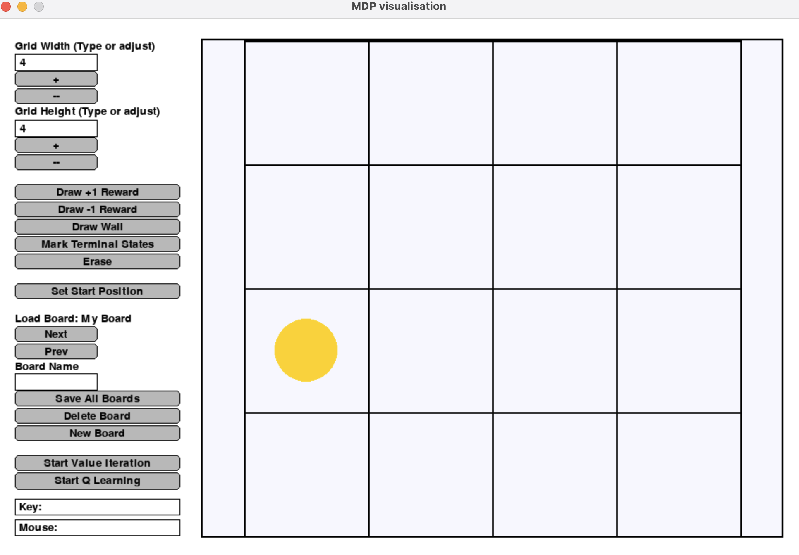

# Markov-Decision-Problem-Simulation

This is a simulation of the standard textbook MDP environment(Robot in a maze) made using SimpleGUI and python.

## Installation

To install all the requirements run

```bash
pip install -r requirements.txt
```

## Environment - Robot in a 2D maze :

**States** - Squares on the grid with cordinates (x,y)

**Actions** - Up, Down, Left or Right (If there are walls in a certain direction, those actions don't exist)

**Rewards** -

* +1 on reaching green square
* -1 on reaching red square
* 0 on all others

You can change the grid and draw reward states (+1, -1, wall) and mark which states are "done states" by drawing on the canvas.

After choosing input, you can run either Value Iteration or Q-Learning.

## Run Simulation

```bash
python main.py
```



There are several buttons on the left, and they are for:

1. adjust the width and height of the grid.
2. draw reward/wall/terminal state on the grid.
3. set start position (the yellow dot on the grid).
4. change/save/delete/create board (you can load a pre-defined maze).
5. start value iteration/q-learning.
